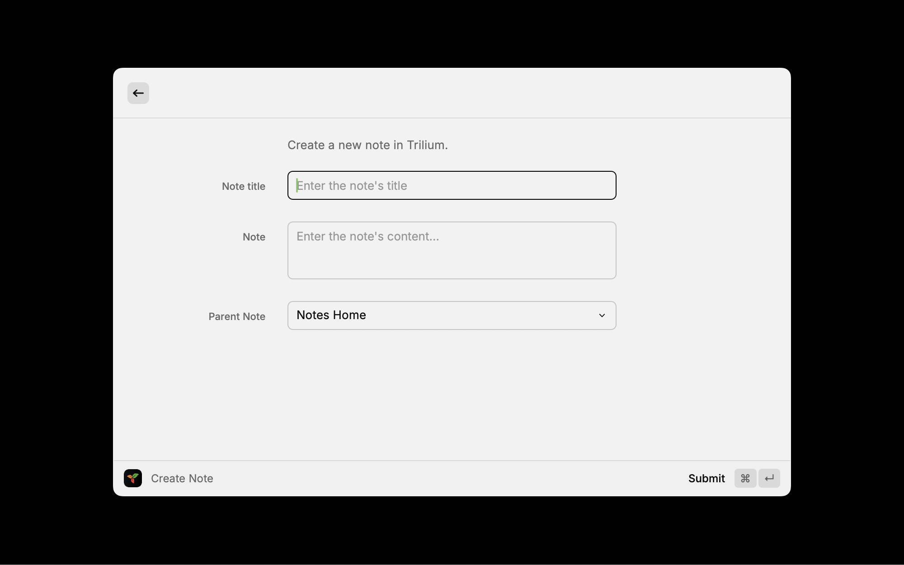

# Trilum Extension for Raycast

This Raycast extension allows you to 

## Features

- Create notes in Trilium
- Specify the parent of the note

## Prerequisites

Before you start using this extension, ensure you have Raycast installed on your system.

## Configuration

You'll need an API key from Trilium. You can generate one by going to `Options > ETAPI` and clicking `Create new ETAPI key`.

## Usage

You can create a note by typing `Create note` and then entering the title and content of the note. You can also select the parent of the note, it defaults to the root of your Trilium instance.

## Support

## Acknowledgements

- [Trilium](https://github.com/zadam/trilium) for creating the awesome note taking app.
- [Raycast](https://raycast.com/) for creating the platform this extension runs on.

## License

MIT

## Copyright

© 2024 - James Turnbull
